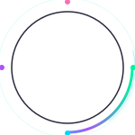
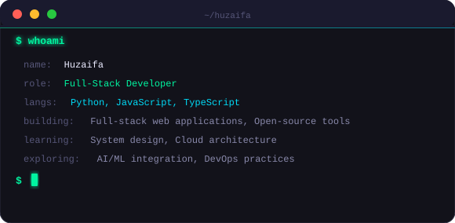
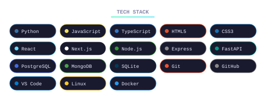
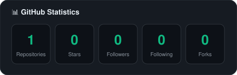

 

  

<b>📘 Languages</b> 
 
 

<b>🎨 Frontend</b> 
 
 
 

<b>⚙️ Backend</b> 
 
 

<b>🗄️ Databases</b> 
 
 

<b>🛠️ Tools</b> 
 
 
 
 

<table align="center" width="80%">
  <tr>
    <th align="center">🛠️ Building</th>
    <th align="center">📚 Learning</th>
    <th align="center">🔭 Exploring</th>
  </tr>
    <tr>
    <td align="center">Full-stack web applications</td>
    <td align="center">System design</td>
    <td align="center">AI/ML integration</td>
  </tr>
  <tr>
    <td align="center">Open-source tools</td>
    <td align="center">Cloud architecture</td>
    <td align="center">DevOps practices</td>
  </tr>
</table>

  
    
  
    
  

 

Built with Python + SVG + GitHub Actions

